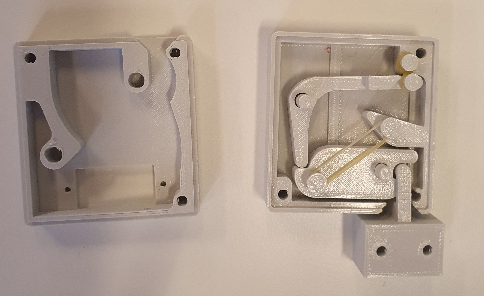
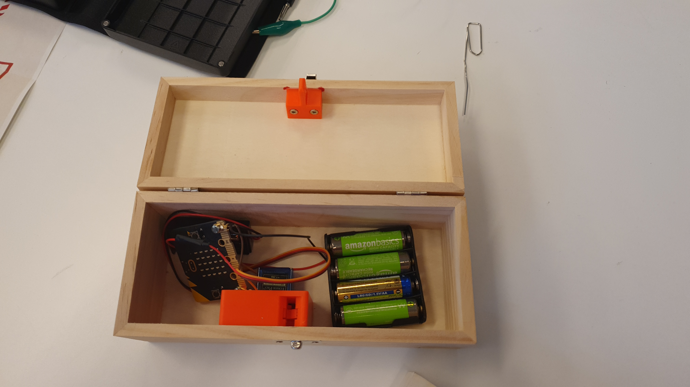

# L'ericscape

[Démo en vidéo](https://youtube.com/shorts/6Gow31ggFCI?feature=share)

## Genèse
En général les boites d'escape game fonctionnent avec des élектro-aimants: ces aimants sont alumés par défaut et sont éteints quand la bonne action est entreprise, permetant l'ouverture de la boite. C'est un peu dommage d'avoir ce fonctionnnement "on" par défaut et nous avons réfléchi à une boite qui fonctionnerait au contraire en étant fermée "au repos" et qui a besoin d'alimentation pour s'ouvrir.

## Cahier des charges de la serrure
La boite devait répondre aux exigences suivantes:
- être fermée par défaut, avoir besoin d'énergie seulement pour s'ouvrir
- avoir un système de "secours" pour qu'on l'ouvre s'il y a un problème
- intégrer un microbit qui déclenche l'ouverture à la réception d'un signal radio
- l'ouverture doit être visible (le couvercle doit se soulever). C'est important dans le cadre d'un jeu de type escape game, pour que les joueurs s'apercevent que quelque chose s'est passé.

## Schéma de la serrure
Eric a concu une serrure qui s'ouvre avec un servo moteur. 

Cette serrure est montée de sorte de pouvoir être ouverte par un servo moteur commandé par un microbit ou par l'insersion d'un trombone dans un trou discret sous la boite.
Un élastique assure le côté "pop" de l'ouverture.

Cette serrure est imprimable en 3D.

## La boite dans son ensemble

## Fichiers pour impression 3D

## Eléments d'électronique et informatique travaillés
* Design et impression 3D
* Gestion d'un servo moteur
* (Beaucoup de bricolage !)
