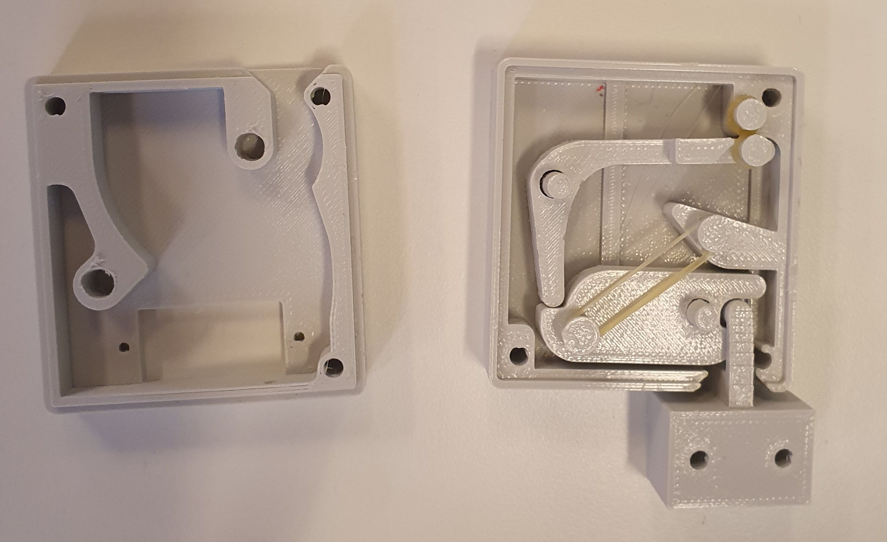
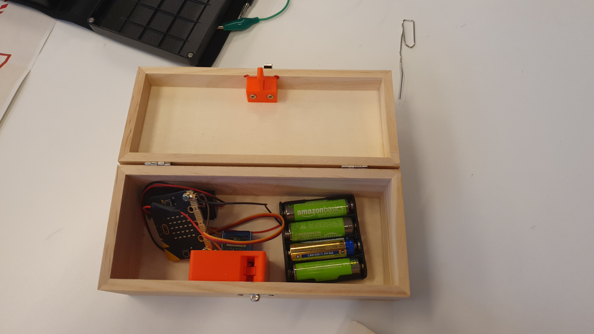

# L'ericscape

TODO: mettre à jour les images et vidéo avec la nouvelle version de la serrure

[Démo en vidéo](https://youtu.be/baRv0PoeU1Q)

## Genèse
En général les boites d'escape game fonctionnent avec des électro-aimants: ces aimants sont alumés par défaut et sont éteints quand la bonne action est entreprise, permetant l'ouverture de la boite. C'est un peu dommage d'avoir ce fonctionnnement "on" par défaut et nous avons réfléchi à une boite qui fonctionnerait au contraire en étant fermée "au repos" et qui a besoin d'alimentation pour s'ouvrir.

## Cahier des charges de la serrure
La boite devait répondre aux exigences suivantes:
- être fermée par défaut, avoir besoin d'énergie seulement pour s'ouvrir
- avoir un système de "secours" pour qu'on l'ouvre s'il y a un problème
- intégrer un microbit qui déclenche l'ouverture à la réception d'un signal radio
- l'ouverture doit être visible (le couvercle doit se soulever). C'est important dans le cadre d'un jeu de type escape game, pour que les joueurs s'apercevent que quelque chose s'est passé.

## Schéma de la serrure
Eric a concu une serrure qui s'ouvre avec un servo moteur. 

Cette serrure est montée de sorte de pouvoir être ouverte par un servo moteur commandé par un microbit ou par l'insersion d'un trombone dans un trou discret sous la boite.
Un élastique assure le côté "pop" de l'ouverture.
Cette serrure est imprimable en 3D.

# Fabrication d'une boite

## Matériel
- Boite : dimensions 20x8,5x7,5cm
Nous avons utilisé ces deux boites: [celle-ci](https://www.galaxus.ch/fr/s5/product/glorex-boite-rectangle-20x85x75cm-fsc-fournitures-pour-loisirs-creatifs-12930330)
et [cette autre] (https://www.galaxus.ch/fr/s5/product/i-am-creative-boite-en-bois-coffre-au-tresor-coffre-a-bijoux-fournitures-pour-loisirs-creatifs-22898985) 
(moins chère) 
- Serrure imrimée en 3D (cf fichiers ci-dessous)
- Servomoteur de type SG90 (attention : nous n'avons pas réussi à faire fonctionner des SG92R). Sur [chipandlove](https://www.chipandlove.ch/fr/accueil/93-servomoteur-sg90-9g-93.html)
- Microbit(v1 suffit) : sur [berrybase](https://www.berrybase.ch/en/bbc-micro-bit-v2.21-go-bundle)
- Elastiques dentaires (vous en trouverez gratuitement chez les orthodentistes ! Sinon en vente [ici](https://www.fruugoschweiz.com/10packs-1000pcs-elastique-dentaire-elastique-bandes-orthodontiques-35oz-5oz-65oz-produit-orthodontique-dentaire/p-172381001-368495361?language=fr&ac=bing))
- Boitier alimentation 5V avec 4 piles AA: sur [berrybase](https://www.berrybase.ch/en/batteriehalter-fuer-4x-mignon-aa-mit-150mm-anschlusskabel-geschlossenem-gehaeuse-und-schalter-wasserabweisend)
- Un trombone (pour l'ouverture secours)

## Fichiers pour impression 3D
Le projet est accessible sur [onshape](https://cad.onshape.com/documents/857442b5f974ab44d4949ac7/w/de1b73ec778c03cdef5c21a4/e/ea2b3c01252a64e7bc468701)
Le fichier est accessible en lecture à toute personne connectée. Il est alors possible de le télécharger au format STL pour l'imprimer.
[Les fichiers stl sont téléchargeables.](serrure_stl.zip)

## Montage électronique
- Brancher la sortie du boitier 4 piles sur les pins GND et 3V du microbit (oui, même si on a 6V en sortie du boitier) ainsi que sur les + et - du servo moteur.
- Le fil  "controle" du servo moteur est branché sur le pin P0 du microbit.
- Vérifier l'angle du servo moteur avant de l'installer dans la serrure
- Il est aussi possible de brancher le servo moteur sur le boitier 4 piles et le microbit sur un boitier 2 piles, en réunissant les GND. Selon nos tests, pas de changement de performance mais moins de place dans la boite.

## Montage mécanique
- Faites un trou sous la boite pour l'ouverture de secours avec un trombone.
- Installer le servo moteur dans la serrure et les deux elastiques.
- Vérifier l'ouverture.
- Visser la serrure et la gâche dans la boite. Cette partie est parfois difficile car la gâche et la serrure doivent bien se correspondre.
- Avant de fermer pour tester, verifier l'ouverture de secours avec un trombonne.
- Mettre les piles, mettre sur on... et ça devrait marcher ! Quand le microbit reçoit le signale "sem", il ouvre la serrure. 

## Gestion du servo moteur

En mode analogique, on a des pulsations régulères (toutes les 20 ms).
Cela peut dépenser de l'énergie inutilement puisqu'on a uniquement besoin de "pousser" quand on ouvre.
Deux solutions pour economiser dans les moments où on n'utilise pas le servo moteur:
- changer la période de pulsations
- passer en digital
On constate bien la différence: le servo moteur n'exercice pas de résistance si on essaye de le pousser quand il est "au repos"

## Code
Le code est disponible [ici](ouverture.py)
Il est conseillé de tester l'ouverture des servo moteurs avant de les installer définitivement.
Après plusieurs tâtonnements, les angles proposés dans le code nous semblent optimaux : ils ont fonctionnés pour les 10 boites réalisées.

## Eléments d'électronique et informatique travaillés
* Design et impression 3D
* Gestion d'un servo moteur
* (Beaucoup de bricolage !)

[def]: https://cad.onshape.com/documents/3392f1d195d84b6c0f49f3b8/w/7acc2ea9644cbdbbe5b3fe8c/e/d5a02ecf17d01a1ba5a197bc

# Entretien de la boite

## Ouverture secours
Ouvrez la boite en introduisant un trombone dans le trou sous la boite. Cela pousse le même élément que celui qui est poussé par le servo moteur.

## Piles
Pour économiser de la batterie, il est important d'éteindre le boitier de 4 piles quand vous n'utilisez pas la boite.
Quand les piles se vident, même partiellement, l'angle du servo moteur peut être impacté et il y a un risque que la boite ne s'ouvre plus.

## Elastiques
Les elastiques s'useront inévitablement. Il faudra alors les remplacer.
Pour cela, dévisser les serrures, les ouvrir, changer l'élastique, refermer, revisser !