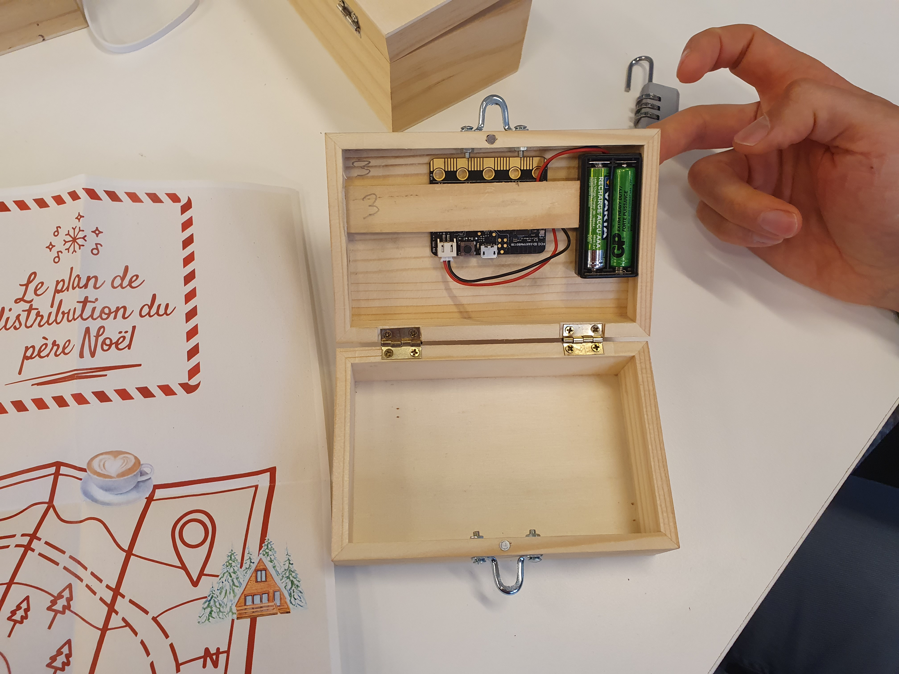

# Escape Box - Enigme Orientation

## Démonstration
[Démo en vidéo](https://youtu.be/dIhlS3zGndY)

## Description
Il s'agit de pencher la boite dans différentes orientations. Si la série est correcte, l'écran affiche le code du cadenas.

## Matériel nécessaire
* Une boite en bois
* Un cadenas et deux fermoirs où passer le cadenas (trouver la bonne distance pour que la boite ne s'entrouve pas)
* quand le cadenas est mis)
* Un microbit

## Montage
On utilise directement le module Orientation des microbits. Aucun branchement à faire.

## Énigme
Sur la boite, on a présenté une succession d'icones, obtenues à la découpeuse vynile. 
Café, Afrique, écriture ou chalet à la montagne.
Chacune correspond à une orientation, donnée par le plan sur l'affiche.
Il fallait pencher la boite successivement dans chacune des orientations correspondant aux icones.
Lorsque la séquence des orientations est correction, l'écran affiche le code du cadenas.

