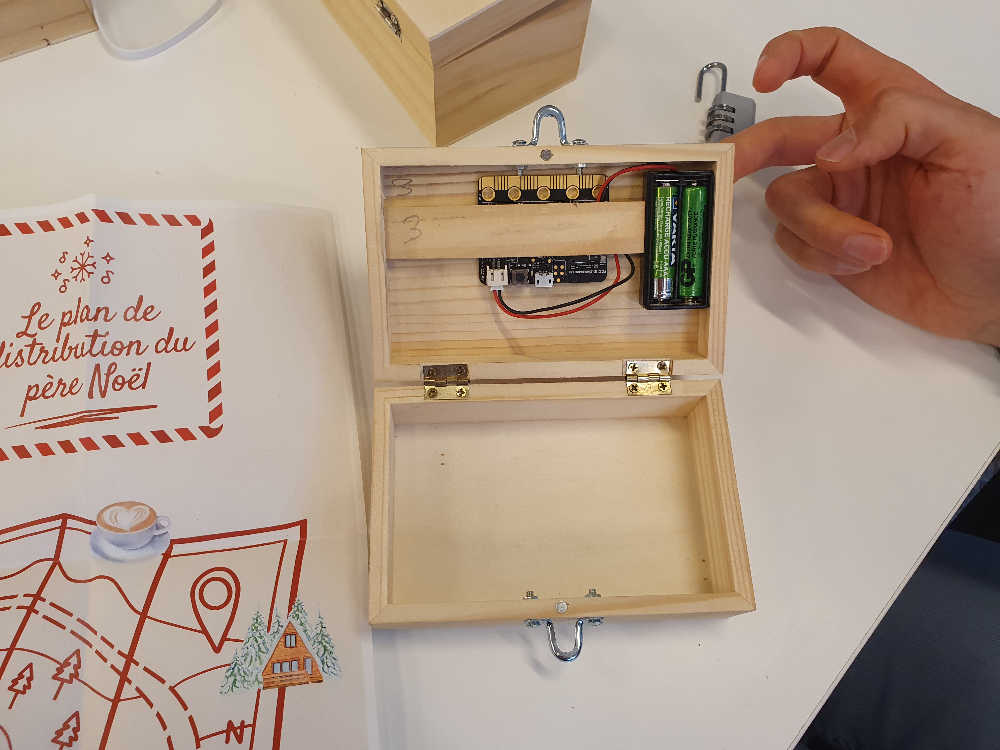

# Escape Box - Enigme Orientation

## Démonstration

## Description
Il s'agit de pencher la boite dans différentes orientations. Si la série est correcte, l'écran affiche le code du cadenas.

## Matériel nécessaire
Une boite en bois
Un cadenas et deux fermoirs où passer le cadenas (trouver la bonne distance pour que la boite ne s'entrouve pas quand le cadenas est mis)
Un microbit

## Énigme
Sur la boite, une liste d'icones. Chacune correspond à une orientation, donnée par un plan.

## Montage
On utilise directement le module Orientation des microbits. Aucun branchement à faire.