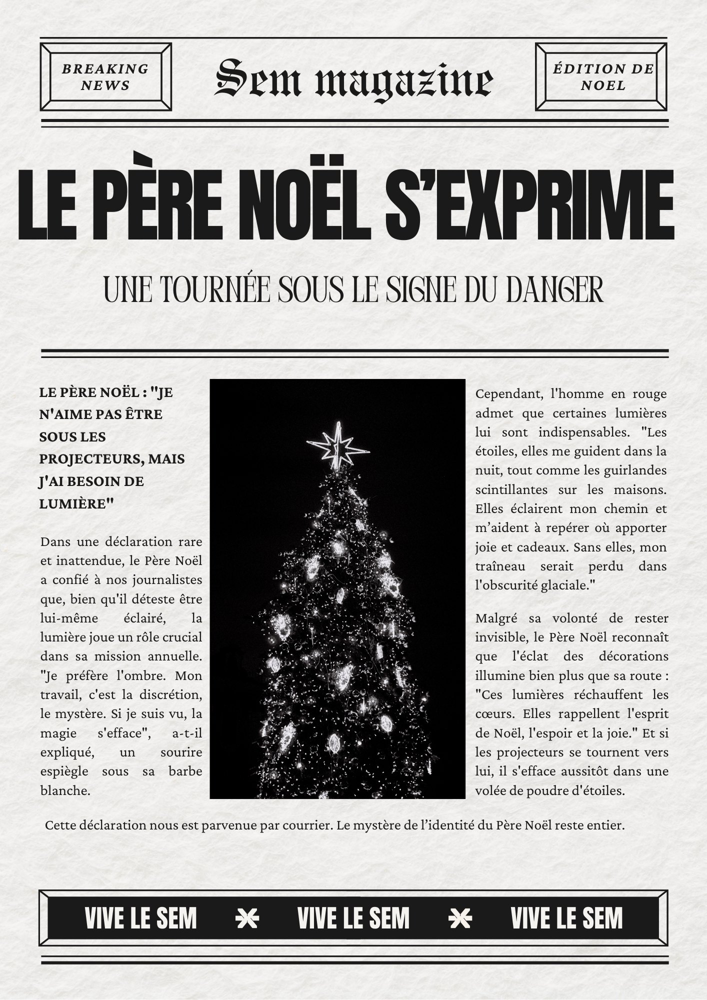

# Escape Box - Enigme lux

[Démo en vidéo](https://youtube.com/shorts/C--asITL_wY?feature=share)

## Description
Sur une boite séparée, des capteurs de lumière sont installés. Il faut en éclairer certains et pas d'autres.
Lorsque les bons capteurs sont éclairés (simultanément), le microbit associé envoie le signal "lux" par radio.
La boite *ericscape* s'ouvre si elle reçoit ce signal.

## Matériel nécessaire
* Une [ericscape](../ericscape_la_biote/ericscape.md)
* Un cadre horologe en bois pour la partie énigme
* Deux microbit (communiquant par radio)
* Trois photorésistances (très bon marché, en général inclues dans les kits de démarages en électronique)

## Montage
Brancher les photorésistances aux pins 0, 1 et 2 du microbit de la boite-énigme.

## Remarques sur le code
On commence par lire la lumière ambiante 500 fois et on en tire une valeur médiane.
On compare ensuite les valeurs des capteurs à cette valeur médiane pour déterminer s'ils sont éclairés.
On calcule pour cela la différence relative `(lecture-médiane)/mediane`. 
Le taux de différence pour décider qu'il y a un changement est paramétrable dans le code (lors de la réalisation initiale, on avait choisi 10%).

## Énigme

Sur le cadre-horloge, on a imprimé un dessin d'un père noël, d'une guirlande et d'une étoile.
On a aussi creusé trois petits trous pour les capteurs de lumière (1 par dessin).
Compléter svg
Le texte de l'affiche suggère qu'il faut éclairer la guirlande et l'étoile mais pas le père noël.
Quand c'est fait, le microbit de la boite-énigme envoie le signal "lux" par radio.
La boite *ericscape* s'ouvre à la réception du signal "lux".

## Eléments d'électronique et informatique travaillés
* Capteurs de lumière
* Analyse de données
* Découpeuse laser et design sur Inkscape
* Communication radio entre microbits
* Ericscape: servo moteur, impression 3D