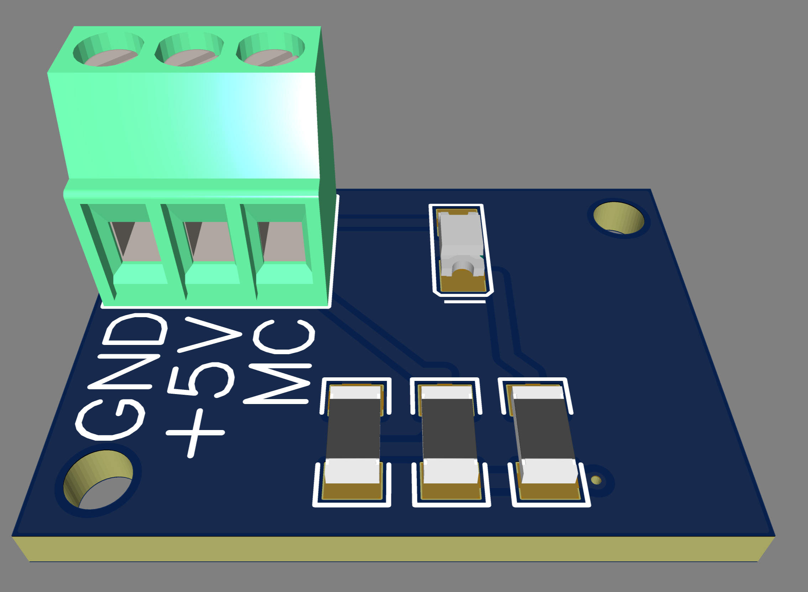

# Escape Box - Enigme Aimants

## Description
Sur une boite séparée, des capteurs magnétiques sont installés. 
S'ils captent des aimants, dans un ordre particulier, le microbit associé envoie le signal "aimant".
La boite *ericscape* s'ouvre si elle reçoit ce signal.

On pose des plaquettes sur la boite à des emplacements prévus.
Les aimants se trouvent sur ces plaquettes, décentrés. 
Il faut donc que les plaquettes recouvrent les bons emplacements de la boite pour que les aimants soient alignés avec les capteurs.

## Matériel nécessaire
Une *ericscape*
Une boite en bois
Deux microbits (un master, un slave)
Trois capteurs hal-effect avec résistances et led intégrées:
- dans le commerce https://sensorkit.joy-it.net/fr/sensors/ky-003
- Ou les capteur que nous avons conçus:

## Énigme
L'affiche indique comment faire la correspondance, et dans quel ordre.

## Montage
On recommande l'utilisation de capteurs à effet hal incluant déjà des résistances et une led qui s'allume en cas de détection d'un signal magnétique.
Dans ce cas, il suffit de brancher les capteurs sur les pins 0, 1 et 2 du microbit "master".