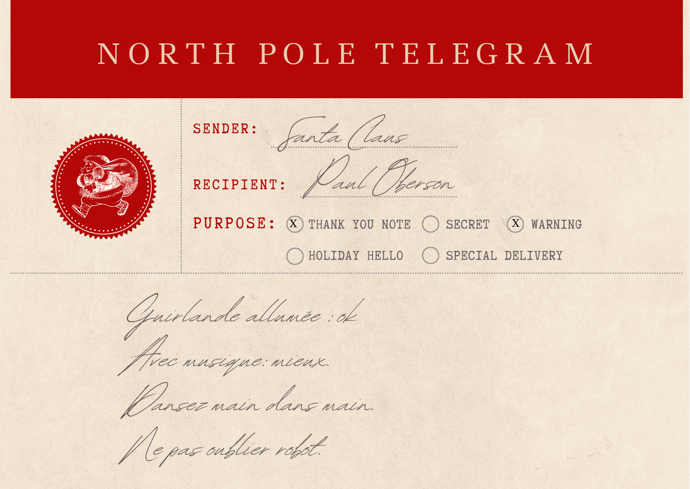

# Escape Box - Enigme Chaine Humaine - animation ordinateur

## Description
Un petit robot tend ses mains : il faut les lui tenir et former une "chaine humaine".
Cette chaine humaine est détectée par un microbit (circuit fermé) qui envoie un message en série à l'ordinateur auquel il est connecté.
Une page web (en javascript) écoute la série et déclenche une animation quand le microbit a envoyé le message.

## Suggestion d'amélioration
Si on veut éviter que le robot soit branché à l'ordinateur, on peut, comme pour les projets qui précèdent, utiliser deux microbits, l'un qui détecte la chaine humaine et envoie un message radio. L'autre qui recoit le message radio et le propage en communiquant en série avec l'ordinateur.

## Matériel nécessaire
* Un ordinateur avec un  microbit branché (communication série entre l'ordinateur et le microbit)
* Sur l'ordinateur, la page web qui écoute la série et peut déclencher une animation.
* Deux fils avec pinces crocodiles
* (Un robot découpé à la laser)

## Montage
Presque rien à monter ! Un fil qui part du pin 0 du microbit et un autre qui part du ground. Quand le circuit est fermé par la chaine humaine, le microbit le détecte (fonction spéciale: `is_touched()` )

## Partie javascript
* On utilise la librairie `ubitwebusb.js` pour la communication avec le microbit
* On propose des boutons pour connecter le microbit branché sur l'ordinateur
* Si on reçoit le signal "chaine" en serial de la part du microbit, on affiche l'animation 

## Énigme
L'affiche indique qu'il faut danser "main dans la main" avec le robot. En faisant la "ronde" avec lui, on complète une "chaîne humaine" qui déclenche l'animation sur l'ordinateur.
A la mains sur l'affiche, on avait indiqué une url raccourcie pour https://divers.fannyboitard.fr/sem_noelchainehumaine/

## Eléments d'électronique et informatique travaillés
* Capteurs de touché (intégré au microbit)
* Communication série avec l'ordinateur
* Découpeuse laser et design sur Inkscape
* Javascript (animations avec p5.js)
* Hébergement d'une page web
