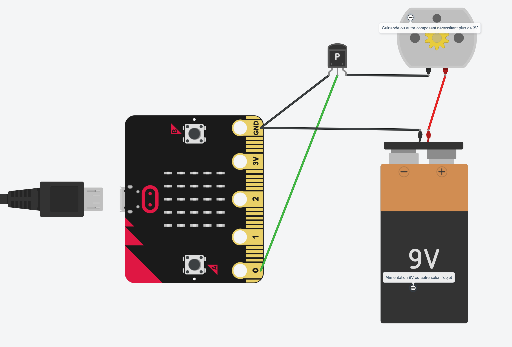
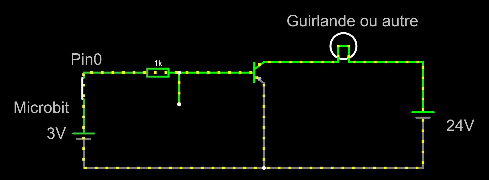

# Escape Box - Sortie 12V

## Description
La sortie d'un PIN d'un microbit est en 3V. Cela ne permet donc pas de contrôler directement un appareil qui nécessiterait une tension plus forte, comme une guirlande de Noël.
On peut néanmoins utiliser un transistor pour contrôler une sortie de 12V.
Un transistor fonctionne comme un interrupteur controlable par le microbit. Il sera donc installé comme interrupteur dans le circuit 12V de la guirlande et ouvert ou fermé par le microbit.

## Matériel nécessaire
* Un transistor PNP. Nous avons utilisé de _2N222_ (par exemple en vente ici : https://fr.aliexpress.com/item/1005008546245280.html?spm=a2g0o.cart.0.0.4102378d0iPrba&mp=1&pdp_npi=5%40dis%21CHF%21CHF%200.77%21CHF%200.44%21%21%21%21%21%40211b819117431788886192273ebc84%2112000045651533634%21ct%21CH%211725575286%21%211%210&gatewayAdapt=glo2fra)
* Un microbit
* Une guirlande de Noël
* Une alimentation 12V

## Montage

## Explications

Fermez et ouvrez l'interrupteur (représente le PIN du mircobit en état haut ou bas) : vous verrez que le circuit de droite est à son tour ouvert ou fermé. Remarquez que le courant du circuit de droite est beaucoup plus important.

[voir le circuit en action (1)](https://www.falstad.com/circuit/circuitjs.html?ctz=CQAgjCAMB0l3BWcMBMcUHYMGZIA4UA2ATmIxAUgoqoQFMBaMMAKDDwg0L3EKrDg8wfKCFyoS2LABY8ZadOJIB-NFGjT10lgBcQhafy4guQ4xCYgGMQjkjEUCYoTDZbZbCBTZY2adjQUMGkDFDxITRUQABM6ADMAQwBXABsdFgAPMWIqb3JpDE0UQxAizQBZAEsAYwAnAHsAI0r0gGdS5y9ijsJwYyoqRJTWuhZainNjAyNe-ngWADcesTVFXpRugdKqTy2YBEzSksxekOIvDHOysQA1FgB3ZbBjBEnZh-0S597prs1ID6-AJUNYrAYfUxefAmbhgqCAkrAmE8JEApYqFFqDG8PbbLz-UT7CGwpHY1HEnhoHiQsAOeFZAT+LwGZB4JBEfL4-F3LIFXrCTQIbrCTndAAKlQAdgCsuEUMh+fBkFcuQBxJKVWopBKS2IAHVa9SSBuSOlqoyAA)

[voir le circuit en action (2)](https://www.falstad.com/circuit/circuitjs.html?ctz=CQAgjCAMB0l3BWcMBMcUHYMGZIA4UA2ATmIxAUgoqoQFMBaMMAKDDwg0L3EKrDg8wfKCFyoSAFhIIOKZhiQD+aKNElrJLAC4hCk-lxBchRiExAMYhHJGIoExSdj7FhSFNljZn7PNmI7BGYNZRAAEzoAMwBDAFcAG20WAA8xQJBPckkMDRQDEDyNAFkASwBjACcAewAjUuSAZ0LiQkz8lrawIyoqWITGuhZKijMjfUM2-ngWADdOsVVJVvaNXsKqbFFe6ARUwoLMNuliTIxTorEANRYAdwXutoQxqbu9Asf3qhQOyDeJxZUZZtbCqP73EyZfDGbiAqD-AqgqiQpHw+bKHiojG8dZA75rba7N4o1TY1HgmE8NA8SFgezwtICZyZfTIPAeGyFTJFG5pHJdVkIDrCbLckAABVKADs-mk8JByMwIMolGANJcAOJxUqVBIxKWRAA6jWqcWN8W0lSGQA)